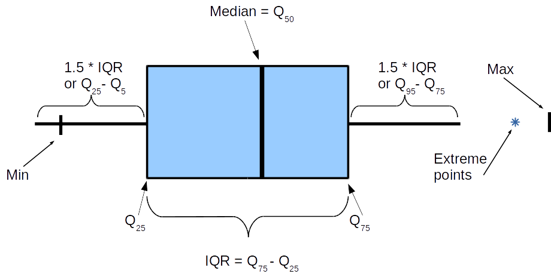

# Статистические методы поиска выбросов

**Выброс (аномалия)** - наблюдение, которое сильно выбивается из общего распределения и существенно отличается от других данных.

В разделе рассматриваются следующие методыЖ
+ [Метод Тьюки](#iqr)
+ [Метод z-отклонений](#z)

## <a id='iqr'>Метод Тьюки (межквартильного размаха)</a>





### Алгоритм метода
-  вычислить 25-ый и 75-ый квантили (первый и третий квартили) — $Q_{25}$ и $Q_{75}$  для признака, который мы исследуем;

- вычислить межквартильное расстояние: 
  - $IQR=Q_{75} - Q_{25}$

- вычислить верхнюю и нижнюю границы Тьюки: 
  - $bound_{lower} = Q_{25} - 1.5*IQR$
  - $bound_{upper} = Q_{75} + 1.5*IQR$

- найти наблюдения, которые выходят за пределы границ.

*и т.д. и т.п.*

## <a id='z'>Метод z-отклонений (метод сигм)</a>


*приведем пример оформления кода*

Использование классических подходов без модификацийЖ
```python
from outliers_lib.find_outliers import outliers_iqr_mod
outliers, cleaned = outliers_iqr_mod(data, feature)
```

$f(x) = \frac{1+x^2}{x^2+5x+1}$
